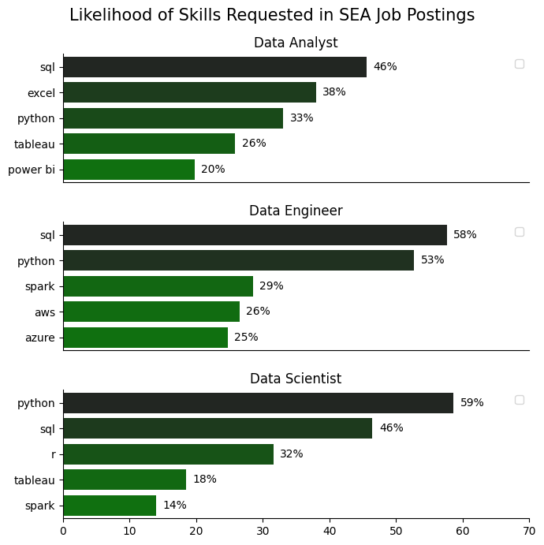

# Overview

Welcome to my analysis of the data job market in the SEA (South East Asia) region, focusing only on data analyst roles. This project was created to put all my Python knowledge that I have just accquired in the Python Course by Luke Barrouse into good practice as well as to understand the job market more effectively. The project delves into the top-paying and in-demand skills to help find optimal job opportunities for data analysts.

The data sourced from [Luke Barousse's Python Course](https://lukebarousse.com/python) which provides a foundation for my analysis, containing detailed information on job titles, working modes, salaries, perks, working locations, and required skills. Through a series of Python scripts, I managed to find answers for key questions such as what is the most demanded skills, what is the salary trends, and how can we identify the intersection of demand and salary in the data analytics sector.

# Key Questions

Below are the questions needed to be answered in the project:

1. What are the top 5 in-demand skills for the top 3 most popular data roles in SEA countries?
2. How are in-demand skills trending for Data Analysts in SEA countries?
3. What are the most well-paid data jobs and data skills in SEA countries?
4. What are the optimal skills for data analysts to learn? (High Demand AND High Paying) 

# Tools of Choice

For my extensive analysis into the data analyst job market in the SEA region, I harnessed the power of several key tools:

- **Python:** The backbone of the analysis process which helps to dissect the raw data and find critical insights. The following Python libraries were used:
    - **Pandas Library:** This was used to analyze the data. 
    - **Matplotlib Library:** This was used to visualize the data.
    - **Seaborn Library:** This was used for customizing advanced visuals. 
- **Jupyter Notebooks:** This tool is used to run Python scripts as well as to include notes and analysis along the way for reference purpose.
- **Visual Studio Code:** It is used for executing the Python scripts.
- **Git & GitHub:** This is an essential tool for version controling and online-sharing the Python code and analysis, enabling collaboration and changes tracking capabilities.

# Data Preparation and Cleanup

This section outlines the steps taken to prepare the data for analysis, ensuring data accuracy, integrity and usability.

## Import & Clean Up Data

Import necessary libraries and load the dataset from an online source, followed by initial data cleaning tasks to ensure data quality.

```python
# Importing Libraries
import ast
import pandas as pd
import seaborn as sns
from datasets import load_dataset
import matplotlib.pyplot as plt  

# Loading Data
dataset = load_dataset('lukebarousse/data_jobs')
df = dataset['train'].to_pandas()

# Data Cleanup
df['job_posted_date'] = pd.to_datetime(df['job_posted_date'])
df['job_skills'] = df['job_skills'].apply(lambda x: ast.literal_eval(x) if pd.notna(x) else x)
```

## Filter Jobs in the SEA region

To extensively focus the analysis on the SEA job market, filters were applied to the dataset, narrowing down to roles based in the ASEAN countries.

```python

SEA_countries = ['Vietnam', 'Thailand','Malaysia','Philippines','Indonesia','Laos','Cambodia','Myanmar','Singapore']

df_SEA = df[df['job_country']isin(SEA_countries)] 
# SEA stands for South East Asia

```

# Data Analysis

Each Jupyter notebook for this project aimed at investigating specific aspects of the data job market in the SEA (South East Asia) region. Here’s how I approached each question:

## 1. What are the top 5 in-demand skills for the top 3 most popular data roles in SEA countries?

To find the most demanded skills for the top 3 most popular data roles. I filtered out those positions by which ones were the most popular, and got the top 5 skills for these top 3 roles. This query highlights the most popular job titles and their top skills, showing which skills I should pay attention to depending on the role I'm targeting. 

View my notebook with detailed steps here: [05.02 Skills_Demand.ipynb](./05.02.%20Skills_Demand.ipynb)

### Visualize Data

```python
fig, ax = plt.subplots(len(top_titles),1)
fig.set_size_inches((7,7))
for i, job_title in enumerate(top_titles):
    df_plot = df_skills_perc[df_skills_perc['job_title_short']== job_title].head(5) # filter for top 5 skills
    sns.barplot(
        data = df_plot,
        x='skill_percent',
        y='job_skills',
        ax = ax[i],
        hue = 'skill_percent',
        palette= 'dark:g_r' # r stands for reverse -> blue and reverse 
    )
    sns.despine()
    ax[i].legend('')
    ax[i].set_title(job_title)
    ax[i].set_ylabel('')
    ax[i].set_xlabel('')
    ax[i].set_xlim(0,70)
    if i != len(top_titles)-1: # this mean that if i = 2, the below code will not be executed
        ax[i].set_xticks([])
    
    #create a loop to place data labels onto the chart
    for n,v in enumerate(df_plot['skill_percent']):
        ax[i].text(x= v+1, y= n, s=f'{v:.0f}%', va= 'center') # va stands for vertical alignment, i guess

fig.suptitle('Likelihood of Skills Requested in SEA Job Postings', fontsize = 15)
fig.tight_layout(h_pad= 2)

plt.show()
```

### Results




*Bar graph visualizing the likelihood of top 5 skills required in job postings of top 3 data roles in the SEA region*

### Insights:

- SQL is the most requested skill for Data Analysts and Data Scientists, with it in over half the job postings for both roles. For Data Engineers, Python is the most sought-after skill, appearing in 68% of job postings.
- Data Engineers require more specialized technical skills (AWS, Azure, Spark) compared to Data Analysts and Data Scientists who are expected to be proficient in more general data management and analysis tools (Excel, Tableau).
- Python is a versatile skill, highly demanded across all three roles, but most prominently for Data Scientists (72%) and Data Engineers (65%).

## 2. How are in-demand skills trending for Data Analysts in SEA countries?

To find how skills are trending in 2023 for Data Analysts, I filtered data analyst positions and grouped the skills by the month of the job postings. This got me the top 5 skills of data analysts by month, showing how popular skills were throughout 2023.

View my notebook with detailed steps here: [05.03 Skills_Trend.ipynb](./05.03.%20Skills_Trend.ipynb)

### Visualize Data

```python

from matplotlib.ticker import PercentFormatter

sns.lineplot(
    data= df_plot,
    dashes= False,
    palette= 'tab10'
)
sns.set_theme(style = 'ticks')
sns.despine()

plt.title('Trending Top Skills for Data Analysts in the SEA region')
plt.ylabel('Likelihood in Job Posting')
plt.xlabel('2023')
plt.legend().remove()

ax = plt.gca()
ax.yaxis.set_major_formatter(PercentFormatter(decimals=0))


for i in range(5):
    if df_plot.columns[i] != 'excel' :
        plt.text(x= 11.2, y= df_plot.iloc[-1,i]+0.5, s= df_plot.columns[i])
    else: 
        plt.text(x= 11.2, y= df_plot.iloc[-1,i]-0.7, s= df_plot.columns[i]) # df.columns returns the name of the column
plt.show()

```

### Results

  
*Bar graph visualizing the trending top skills for data analysts in the SEA region in 2023.*

### Insights:
- SQL remains the most consistently demanded skill throughout the year, although it shows a gradual decrease in demand.
- Excel experienced a significant increase in demand starting around September, surpassing both Python and Tableau by the end of the year.
- Both Python and Tableau show relatively stable demand throughout the year with some fluctuations but remain essential skills for data analysts. Power BI, while less demanded compared to the others, shows a slight upward trend towards the year's end.

## 3. ## What are the most well-paid data jobs and data skills in SEA countries?

### Salary Distributions of the top 6 popular jobs in SEA countries
To identify the highest-paying roles and skills, I only got jobs in the SEA countries and looked at their median salary. But first I looked at the salary distributions of the most common data jobs like Data Scientist, Data Engineer, and Data Analyst, etc. to get an idea of which jobs are paid the most. 

View my notebook with detailed steps here: [05.04 Salary_Analysis.ipynb](./05.04.%20Salary_Analysis.ipynb)

#### Visualize Data 

```python
sns.boxplot(
    data= df_SEA_top6,
    x= "salary_year_avg",
    y= "job_title_short",
    order= job_order # seaborn also has a param to organize the order of categories
)
sns.set_theme(style= 'ticks')
sns.despine()

plt.title('Salary Distributions in the SEA Region')
plt.xlabel('Yearly Salary (USD)')
plt.ylabel('')
ticks_x = plt.FuncFormatter(lambda y, pos: f'{int(y/1000)}K')
plt.gca().xaxis.set_major_formatter(ticks_x)
plt.show()

```

#### Results

  
*Box plot visualizing the salary distributions for the top 6 data job titles across countries in the SEA region.*

#### Insights

- There's a significant variation in salary ranges across different job titles. Senior Data Scientist positions tend to have the highest salary potential, with up to $600K, indicating the high value placed on advanced data skills and experience in the industry.

- Senior Data Engineer and Senior Data Scientist roles show a considerable number of outliers on the higher end of the salary spectrum, suggesting that exceptional skills or circumstances can lead to high pay in these roles. In contrast, Data Analyst roles demonstrate more consistency in salary, with fewer outliers.

- The median salaries increase with the seniority and specialization of the roles. Senior roles (Senior Data Scientist, Senior Data Engineer) not only have higher median salaries but also larger differences in typical salaries, reflecting greater variance in compensation as responsibilities increase.

### Highest Paid & Most Demanded Skills for Data Analysts

Next, I narrowed my analysis and focused only on Data Analyst roles. I looked at the highest-paid skills and the most in-demand skills. I used two bar charts to showcase these.

#### Visualize Data

```python

fig, ax = plt.subplots(2,1)

sns.barplot(
    data= df_DA_SEA_top_pay,
    x= 'median',
    y= 'job_skills',
    hue = 'median',
    palette= 'dark:b_r',
    ax= ax[0]
)

ax[0].set_xlabel('')
ax[0].set_ylabel('')
ax[0].legend('')
ax[0].set_xlim(0,170000)
ax[0].set_title('Top 10 Highest Paid Skills for Data Analysts')
ax[0].xaxis.set_major_formatter(plt.FuncFormatter(lambda x,pos: f'${int(x/1000)}K'))

sns.barplot(
    data= df_DA_SEA_pop_skills,
    x= 'median',
    y= 'job_skills',
    hue = 'median',
    palette= 'light:b',
    ax= ax[1]
)

ax[1].set_xlabel('Median Salary (USD)')
ax[1].set_ylabel('')
ax[1].legend('')
ax[1].set_xlim(0,170000)
ax[1].set_title('Top 10 Most In-Demand Skills for Data Analysts')
ax[1].xaxis.set_major_formatter(plt.FuncFormatter(lambda x,pos: f'${int(x/1000)}K'))

fig.tight_layout()

plt.show()

```

#### Results
Here's the breakdown of the highest-paid & most in-demand skills for data analysts in the US:


*Two separate bar graphs visualizing the highest paid skills and most in-demand skills for data analysts in the US.*

#### Insights:

- The top graph shows specialized technical skills like `dplyr`, `Bitbucket`, and `Gitlab` are associated with higher salaries, some reaching up to $200K, suggesting that advanced technical proficiency can increase earning potential.

- The bottom graph highlights that foundational skills like `Excel`, `PowerPoint`, and `SQL` are the most in-demand, even though they may not offer the highest salaries. This demonstrates the importance of these core skills for employability in data analysis roles.

- There's a clear distinction between the skills that are highest paid and those that are most in-demand. Data analysts aiming to maximize their career potential should consider developing a diverse skill set that includes both high-paying specialized skills and widely demanded foundational skills.

## 4. What are the most optimal skills to learn for Data Analysts in the SEA region?

To identify the most optimal skills to learn (the ones that are the highest paid and the highly sought-after) I calculated the percent of skill demand and the median salary of these skills. To easily identify which are the most optimal skills to learn. 

View my notebook with detailed steps here: [05.05 Optimal_Skills.ipynb](./05.05.%20Optimal_Skills.ipynb).

#### Visualize Data

```python
from adjustText import adjust_text
import matplotlib.pyplot as plt

plt.scatter(df_DA_skills_high_demand['skill_percent'], df_DA_skills_high_demand['median_salary'])
plt.show()

```

#### Results

    
*A scatter plot visualizing the most optimal skills (high paying & high demand) for data analysts in the US.*

#### Insights:

- The skill `Oracle` appears to have the highest median salary of nearly $97K, despite being less common in job postings. This suggests a high value placed on specialized database skills within the data analyst profession.

- More commonly required skills like `Excel` and `SQL` have a large presence in job listings but lower median salaries compared to specialized skills like `Python` and `Tableau`, which not only have higher salaries but are also moderately prevalent in job listings.

- Skills such as `Python`, `Tableau`, and `SQL Server` are towards the higher end of the salary spectrum while also being fairly common in job listings, indicating that proficiency in these tools can lead to good opportunities in data analytics.

### Visualizing Different Techonologies

Let's visualize the different technologies as well in the graph. We'll add color labels based on the technology (e.g., {Programming: Python})

#### Visualize Data

```python
# Create the scatter plot

sns.scatterplot(
    data = df_plot,
    x = 'skill_perc',
    y= 'median_salary',
    hue = 'technology'
)
sns.despine()

# Prepare texts for adjustText
texts=[]
for i, txt in enumerate(df_plot['skills']):
    texts.append(plt.text(df_plot['skill_perc'].iloc[i],df_plot['median_salary'].iloc[i], txt))

# Adjust text to avoid overlaps
adjust_text(texts,arrowprops=dict(arrowstyle='->',color = 'red'))

# Set axis labels, title
plt.xlabel('Percent of DA jobs') 
plt.ylabel('Median Yearly Salary')
plt.title(f'Most Optimal Skills for Data Analysts in SEA countries')

# Format X&Y axes' tick values
ax = plt.gca()
ax.yaxis.set_major_formatter(plt.FuncFormatter(lambda y,pos: f'${int(y/1000)}K'))
from matplotlib.ticker import PercentFormatter
ax.xaxis.set_major_formatter(plt.FuncFormatter(lambda x,pos: f'{int(x)}%'))

plt.show()

```

#### Results

  
*A scatter plot visualizing the most optimal skills (high paying & high demand) for data analysts in the SEA region with color labels for technology.*

#### Insights:

- The scatter plot shows that most of the `programming` skills (colored blue) tend to cluster at higher salary levels compared to other categories, indicating that programming expertise might offer greater salary benefits within the data analytics field.

- The database skills (colored orange), such as Oracle and SQL Server, are associated with some of the highest salaries among data analyst tools. This indicates a significant demand and valuation for data management and manipulation expertise in the industry.

- Analyst tools (colored green), including Tableau and Power BI, are prevalent in job postings and offer competitive salaries, showing that visualization and data analysis software are crucial for current data roles. This category not only has good salaries but is also versatile across different types of data tasks.

# Lessons Learned

Throughout this project, I deepened my understanding of the data analyst job market and enhanced my technical skills in Python, especially in data manipulation and visualization. Here are a few specific things I learned:

- **Advanced Python Usage**: Utilizing libraries such as Pandas for data manipulation, Seaborn and Matplotlib for data visualization, and other libraries helped me perform complex data analysis tasks more efficiently.
- **Data Cleaning Importance**: I learned that thorough data cleaning and preparation are crucial before any analysis can be conducted, ensuring the accuracy of insights derived from the data.
- **Strategic Skill Analysis**: The project emphasized the importance of aligning one's skills with market demand. Understanding the relationship between skill demand, salary, and job availability allows for more strategic career planning in the tech industry.


# Summarized Insights

This project provided several general insights into the data job market for analysts:

- **Skill Demand and Salary Correlation**: There is a clear correlation between the demand for specific skills and the salaries these skills command. Advanced and specialized skills like Python and Oracle often lead to higher salaries.
- **Market Trends**: There are changing trends in skill demand, highlighting the dynamic nature of the data job market. Keeping up with these trends is essential for career growth in data analytics.
- **Economic Value of Skills**: Understanding which skills are both in-demand and well-compensated can guide data analysts in prioritizing learning to maximize their economic returns.


# Project's Challenges

This project was not without its challenges, but it provided good learning opportunities:

- **Data Inconsistencies**: Handling missing or inconsistent data entries requires careful consideration and thorough data-cleaning techniques to ensure the integrity of the analysis.
- **Complex Data Visualization**: Designing effective visual representations of complex datasets was challenging but critical for conveying insights clearly and compellingly.
- **Balancing Breadth and Depth**: Deciding how deeply to dive into each analysis while maintaining a broad overview of the data landscape required constant balancing to ensure comprehensive coverage without getting lost in details.


# Conclusion

This exploration into the data analyst job market has been incredibly informative, highlighting the critical skills and trends that shape this evolving field. The insights I got enhance my understanding and provide actionable guidance for anyone looking to advance their career in data analytics. As the market continues to change, ongoing analysis will be essential to stay ahead in data analytics. This project is a good foundation for future explorations and underscores the importance of continuous learning and adaptation in the data field.

